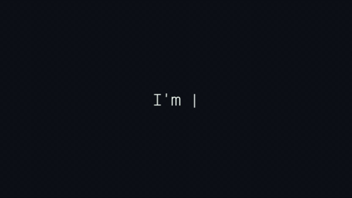

# 👋 Olá, bem vindo(a) ao meu perfil !! 

  <a href="https://github.com/LuscaMD">
  
  

    
## Skills :nerd_face:

    
    
    
    
    
    
   

<!--

    

-->

📘 Atualmente estudando JavaScript ES6

#

